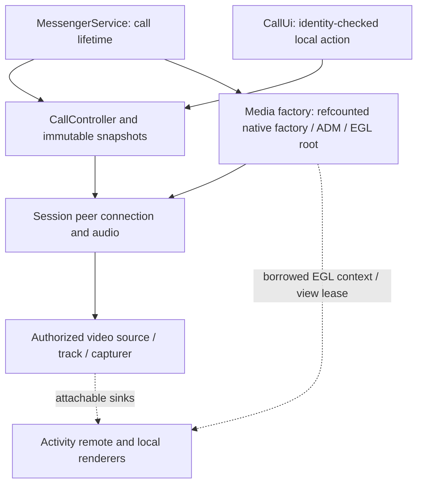
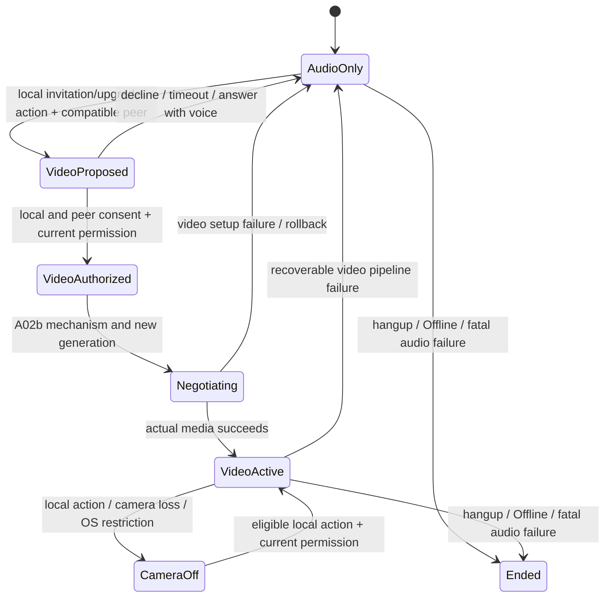

# Android video calling — A01 ownership and state map

Approved source: `.ai-planner/sessions/20261002-223910-bd586a/planning/plan-v007.md`,
SHA-256 `4ea7877d6643b5c89246b075d7a301d73b38bea28f644303383fa42f7ca0efbf`.
Execution authorized 2026-10-03 for the Android section. This is the A01 design,
not a claim that production video is implemented.

## Existing implementation reviewed

| Component | Current responsibility | Planned video boundary |
| --- | --- | --- |
| `PeerEngine` | TLS HELLO, certificate verification, READY, CALLCONNECT socket handoff; group CAPS=2 and FILECAPS=STREAM1 | Independent authenticated CALLCAPS transaction; failures mean audio-only |
| `CallSignaling` | Four-byte length followed by UTF-8 v/t/cid/seq/gen/b JSON | Strict version-2 body validation after A02b; keep version-1 bytes |
| `CallProtocol` | Voice invitation admission, call lifecycle, limits | Separate video consent and negotiation state, never infer consent from capability |
| `CallController` | Service-owned session, injected media, serialized commands, timers | Authorize negotiation by call/peer/request/generation; reject stale callbacks |
| `CallSession` | Immutable voice snapshot | Distinct offered/accepted video, local/remote camera, switch revision and negotiation state |
| `ICallMedia` / fake | Audio SDP/ICE, mute, lifetime and stats | Independent video capture, sink and recoverable-error interface after gate |
| `WebRtcCallMedia` | Refcounted factory/ADM, per-session worker, audio source/track; no video factories | Service-owned EGL root, video source/track/capturer and shared factory |
| `CallUi` | Service-owned passive view-model, retained terminal state | Call-bound permission/consent commands and bounded diagnostics snapshots |
| `CallView` | Activity overlay, controls, rebuilt snapshot presentation | Activity renderers borrow EGL; attach/detach without restarting capture |

Current Android and Windows adapters only accept OFFER/ANSWER while Connecting.
Android `CallController.onFrame` does not yet provide full duplicate/call-ID/generation
tracking; these are explicit A07 work, not fixes included in this design step.
The factory is currently process-static and released at the last session. A05 must
make ownership and teardown explicit under the service and handle view leases before
disposing the shared EGL root. Prototype implementation is independent.

## Production ownership and release order

The service retains media independently of Activity creation, rotation, minimize or
destruction. Each view acquires a renderer lease on the shared EGL context, attaches
sinks once, and detaches then releases both renderers on replacement. The lease is
released only after renderer release; the factory/root cannot be disposed while any
view lease remains. No Activity or View reference is retained by the controller.

Terminal teardown: invalidate per-call commands and callbacks; stop capture; detach
all sinks and release renderers on their owner thread; dispose capturer and texture
helper; remove/dispose video and audio tracks/sources; close and dispose the peer
connection; release session factory reference, then factory/ADM and EGL root when
both session and renderer lease counts reach zero. Finally clear notification,
self-view placement and in-app diagnostics. A copied OS clipboard report is outside
this lifetime. Teardown must be idempotent and bounded; no native callback waits on
the controller, socket writer or UI thread.

## Separate consent, camera, mute and negotiation states

Audio mute is an independent boolean in every connected state. Camera-off stops
local capture and clears the local frame; it does not mute audio. Hiding the local
self-view only detaches its rendering sink. Camera switching preserves the sender
and track where supported and increments a bounded per-call revision. A remote
camera-state message never starts local capture.

Initial video: local caller action creates a proposal; incoming invitation displays
Accept video and Answer with voice. The callee may select audio even if capable.
Upgrade: an audio call stays Connected while the request is pending; both parties
must authorize it. Capability success, receiving an invitation, or displaying a
screen is insufficient. Permission requests carry the call ID and an action token;
hangup, Offline, replacement, denial or revocation invalidate them.

Rollback keeps the healthy audio connection and microphone ownership. The exact
SDP/transceiver rollback and collision policy are provisional until paired AP01/WT01
evidence passes A02b. No production Connected-state SDP is enabled before that gate.

## Acceptance / verification

A01 design reviewed against the eight Android components and the Windows voice
envelope/admission table. A01 is complete as a design artifact. No production media,
camera acquisition, wire change or device acceptance is asserted by this document.
